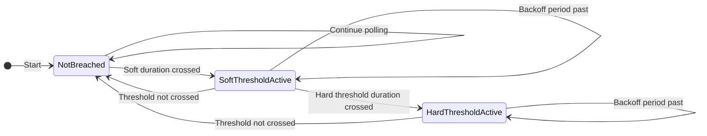

# Metric Reader

A program that monitors Prometheus metrics and executes actions when thresholds are exceeded for a specified duration. Due to its small footprint, it was designed to run as a sidecar container in a Kubernetes Pod, though it can also be run as a service, and with the right plugin it can interact with other services and cloud provider APIs.

## Features

- Monitor any Prometheus metric
- Configurable soft and hard thresholds with duration requirements
- Plugin system for custom actions with automatic validation
- Selective plugin loading - only specified plugins are loaded
- Built-in logging and file creation plugins
- Configurable polling interval and backoff periods
- Leader election mechanism for running multiple replicas at the same time with a single action outcome
- Fail-fast configuration validation at startup

## Threshold State Machine

The metric reader implements a state machine to manage soft and hard threshold transitions. This ensures that thresholds are activated in the correct order and that plugins are executed at the appropriate times.

### States

The state machine has three states:

- **`NotBreached`**: Initial state. The metric value has not exceeded any configured thresholds for the required duration.
- **`SoftThresholdActive`**: The metric has exceeded the soft threshold for the configured duration. The soft threshold plugin has been executed.
- **`HardThresholdActive`**: The metric has exceeded the hard threshold for the configured duration while in the `SoftThresholdActive` state. The hard threshold plugin has been executed.

### State Transitions



### Transition Details

1. **`NotBreached` → `SoftThresholdActive`**
   - Triggered when the metric value crosses the soft threshold and remains crossed for the configured `THRESHOLD_DURATION`
   - The soft threshold plugin is executed upon entering this state
   - If a `BACKOFF_DELAY` is configured, the plugin won't execute again until the backoff period expires

2. **`SoftThresholdActive` → `NotBreached`**
   - Triggered when the metric value drops below the soft threshold
   - State timers are reset
   - System returns to monitoring mode

3. **`SoftThresholdActive` → `HardThresholdActive`**
   - Triggered when the metric value crosses the hard threshold and remains crossed for the configured `THRESHOLD_DURATION` while already in `SoftThresholdActive` state
   - The hard threshold plugin is executed upon entering this state
   - **Note**: You cannot transition directly from `NotBreached` to `HardThresholdActive`; you must first enter `SoftThresholdActive`

4. **`SoftThresholdActive` → `SoftThresholdActive`** (re-execution)
   - Occurs when the backoff period expires and the threshold is still crossed
   - The soft threshold plugin is executed again
   - A new backoff period begins

5. **`HardThresholdActive` → `NotBreached`**
   - Triggered when the metric value drops below the soft threshold (or both thresholds)
   - State timers are reset
   - System returns to monitoring mode

6. **`HardThresholdActive` → `HardThresholdActive`** (re-execution)
   - Occurs when the backoff period expires and the threshold is still crossed
   - The hard threshold plugin is executed again
   - A new backoff period begins

### Debug Logging

To see detailed state machine transitions and plugin executions, set `LOG_LEVEL=debug`. This will log:

- Current state and threshold crossing status
- State transitions with previous and new state names
- Plugin execution start and completion
- Duration timers and backoff periods

Example debug output:
```json
{"level":"debug","current_state":"NotBreached","soft_crossed":true,"hard_crossed":false,"value":90,"message":"evaluating threshold state machine"}
{"level":"info","previous_state":"NotBreached","new_state":"SoftThresholdActive","value":90,"soft_threshold":80,"message":"state transition: entering soft threshold active state"}
{"level":"debug","plugin":"log_action","state":"SoftThresholdActive","message":"executing soft threshold plugin"}
{"level":"info","plugin":"log_action","state":"SoftThresholdActive","message":"soft threshold plugin executed successfully"}
```

## Quick Start with Just

This project uses [Just](https://github.com/casey/just) as a command runner. Install it first, then you can use the following commands:

```bash
# List all available commands
just

# Build the application
just build

# Build plugin .so files
just build-plugins

# Run all tests
just run-tests

# Build Docker image
just build-image

# Start services using Docker Compose
just compose-up

# Stop and remove services using Docker Compose
just compose-down

# Create and configure Kind cluster
just kind-up

# Delete Kind cluster
just kind-down

# Deploy metric-reader to Kind cluster
just k8s-apply

# Delete metric-reader from Kind cluster
just k8s-delete

# Run end-to-end tests (creates Kind cluster, deploys app, and validates)
just e2e-test

# Clean up (remove binaries, plugins, and Kind cluster)
just clean
```

## Configuration

The service can be configured through either a configuration file or environment variables. Environment variables take precedence over configuration file values.

### Configuration File

Create a `config.toml` file in the current directory or `/etc/metric-reader/` with your configuration. See `config.toml.example` for a complete example.

Example `config.toml`:

```toml
log_level = "info"
metric_name = "up"
threshold_operator = "greater_than"
polling_interval = "15s"
prometheus_endpoint = "http://prometheus:9090"

# Soft threshold configuration (new recommended structure)
[soft]
threshold = 80.0
plugin = "log_action"
duration = "30s"
backoff_delay = "1m"

# Hard threshold configuration (new recommended structure)
[hard]
threshold = 100.0
plugin = "file_action"
duration = "30s"
backoff_delay = "1m"

# Plugin-specific configuration in separate sections
[plugins.file_action]
dir = "/tmp/metric-files"
size = 1048576  # 1MB

[plugins.efs_emergency]
# file_system_id = "fs-0123456789abcdef0"
# aws_region = "us-east-1"
```

**Note:** The new nested `[soft]` and `[hard]` sections are recommended for threshold configuration. Each section can have its own `threshold`, `plugin`, `duration`, and `backoff_delay` settings. The old flat structure (e.g., `soft_threshold`, `threshold_duration`) is still supported for backward compatibility.

### Environment Variables

All configuration options can be set via environment variables using uppercase names:

| Variable | Description | Default |
|----------|-------------|---------|
| `METRIC_NAME` | Name of the Prometheus metric to monitor | (required) |
| `LABEL_FILTERS` | Label filters to apply to the metric query | (optional) |
| `THRESHOLD_OPERATOR` | Threshold operator: `greater_than` or `less_than` | (required with thresholds) |
| `SOFT_THRESHOLD` | Soft threshold value (float) | (optional) |
| `SOFT_DURATION` | How long soft threshold must be exceeded before action | (uses THRESHOLD_DURATION if not set) |
| `SOFT_BACKOFF_DELAY` | Delay between soft threshold actions | (uses BACKOFF_DELAY if not set) |
| `HARD_THRESHOLD` | Hard threshold value (float) | (optional) |
| `HARD_DURATION` | How long hard threshold must be exceeded before action | (uses THRESHOLD_DURATION if not set) |
| `HARD_BACKOFF_DELAY` | Delay between hard threshold actions | (uses BACKOFF_DELAY if not set) |
| `SOFT_THRESHOLD_PLUGIN` | Plugin to execute when soft threshold is exceeded | (optional) |
| `HARD_THRESHOLD_PLUGIN` | Plugin to execute when hard threshold is exceeded | (optional) |
| `THRESHOLD_DURATION` | Default duration for both thresholds (deprecated) | 0s |
| `BACKOFF_DELAY` | Default backoff delay for both thresholds (deprecated) | 0s |
| `POLLING_INTERVAL` | How often to check the metric | 1s |
| `PROMETHEUS_ENDPOINT` | Prometheus server URL | http://prometheus:9090 |
| `PLUGIN_DIR` | Directory containing plugin .so files | (optional) |
| `LOG_LEVEL` | Logging level (debug, info, warn, error) | info |
| `LEADER_ELECTION_ENABLED` | Whether to enable leader election | true |
| `LEADER_ELECTION_LOCK_NAME` | Name of the lock to use for leader election | metric-reader-leader |
| `LEADER_ELECTION_LOCK_NAMESPACE` | Kubernetes namespace for leader election lock (uses pod's namespace if not set) | (optional) |
| `MISSING_VALUE_BEHAVIOR` | Behavior when metric returns no data: `last_value`, `zero`, `assume_breached` | zero |

### Missing Value Behavior

When a Prometheus query returns no data, the behavior is controlled by `MISSING_VALUE_BEHAVIOR`:

- **`last_value`**: Uses the last successfully retrieved metric value. If no previous value exists, threshold checks are skipped for that iteration.
- **`zero`** (default): Treats the missing value as 0 and processes threshold checks normally.
- **`assume_breached`**: Immediately marks all configured thresholds as crossed, starting the threshold duration timer. This is useful for detecting when a metric disappears entirely.

## Available Plugins

### File Action Plugin

Creates a file of configurable size when a metric threshold is exceeded.

**Configuration (via config file):**

```toml
[plugins.file_action]
dir = "/tmp/metric-files"  # Directory where files will be created
size = 1048576             # Size of files to create in bytes (1MB)
```

**Configuration (via environment variables):**

- `FILE_ACTION_DIR`: Directory where files will be created (default: `/tmp/metric-files`)
- `FILE_ACTION_SIZE`: Size of files to create in bytes (default: 1MB)

### Log Action Plugin

Logs threshold events with detailed information about the metric value and duration.

### EFS Emergency Plugin

Switches an AWS EFS filesystem from bursting throughput mode to elastic throughput mode. Designed for emergency situations when EFS burst credits are depleted.

**Configuration (via config file):**

```toml
[plugins.efs_emergency]
file_system_id = "fs-0123456789abcdef0"        # The EFS filesystem ID (static - optional if using label)
file_system_prometheus_label = "file_system_id" # Prometheus metric label name (optional if using static ID)
aws_region = "us-east-1"                        # AWS region (optional, auto-detected)
```

**Configuration (via environment variables):**

- `EFS_FILE_SYSTEM_ID`: The EFS filesystem ID (static - optional if using label)
- `EFS_FILE_SYSTEM_PROMETHEUS_LABEL`: Prometheus metric label name to extract filesystem ID from (optional if using static ID)
- `AWS_REGION`: AWS region where the filesystem is located (optional, auto-detected)

**Requirements:**

- AWS credentials (supports IRSA on EKS, EC2 instance profiles, environment variables)
- IAM permissions: `elasticfilesystem:UpdateFileSystem`, `elasticfilesystem:DescribeFileSystems`

See [plugins/efs_emergency/README.md](plugins/efs_emergency/README.md) for detailed setup instructions, IAM configuration, dynamic label extraction, and IRSA setup on EKS.

## CI/CD

This project includes automated end-to-end tests that run on every push to any branch (excluding tags):

- **GitHub Actions Workflow**: `.github/workflows/e2e-tests.yml`
- **Test Environment**: Kind (Kubernetes in Docker) cluster
- **Timeout**: 5 minutes maximum
- **Concurrency**: Previous runs are automatically cancelled when a new commit is pushed

The e2e tests validate that the metric-reader can be successfully deployed to a Kubernetes cluster alongside Prometheus and that the application starts correctly.

## Building

```bash
# Build the main service
go build -o metric-reader

# Build plugins (from the metric-reader directory)
go build -buildmode=plugin -o plugins/file_action.so plugins/file_action/file_action.go
go build -buildmode=plugin -o plugins/log_action.so plugins/log_action/log_action.go
```

## Docker

Build and run using Docker:

```bash
# Build the image
docker build -t metric-reader .

# Run the container
docker run -d \
  -e METRIC_NAME="your_metric" \
  -e THRESHOLD_OPERATOR="greater_than" \
  -e SOFT_THRESHOLD="80" \
  -e HARD_THRESHOLD="100" \
  -e SOFT_THRESHOLD_PLUGIN="log_action" \
  -e HARD_THRESHOLD_PLUGIN="file_action" \
  -e THRESHOLD_DURATION="5m" \
  -e PLUGIN_DIR="/plugins" \
  -v /path/to/plugins:/plugins \
  metric-reader
```

## Example Use Cases

### AWS EFS Burst Credit Monitoring

Monitor AWS EFS burst credits and automatically generate I/O activity to increase credits when they fall below a threshold.

## Creating Custom Plugins

See the [plugins README](plugins/README.md) for information on creating custom plugins.

**Important Notes:**
- Plugins must implement the `ValidateConfig()` method to validate configuration at startup
- Only plugins specified in `SOFT_THRESHOLD_PLUGIN` or `HARD_THRESHOLD_PLUGIN` are loaded
- The application will fail fast with clear error messages if plugin configuration is invalid

## Contributing

When adding new features:
- **Always update README.md** with user-facing documentation
- **Always update .github/copilot-instructions.md** with implementation details
- Update config.toml.example with new configuration options
- Add tests for new functionality
